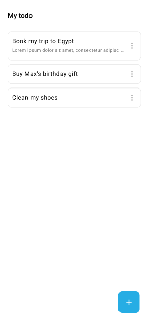
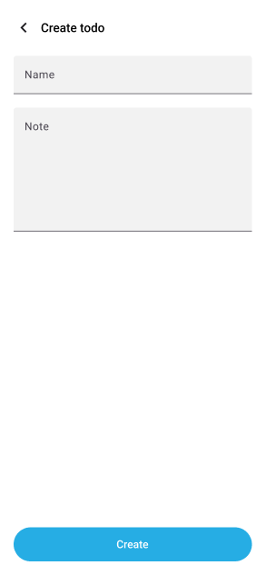
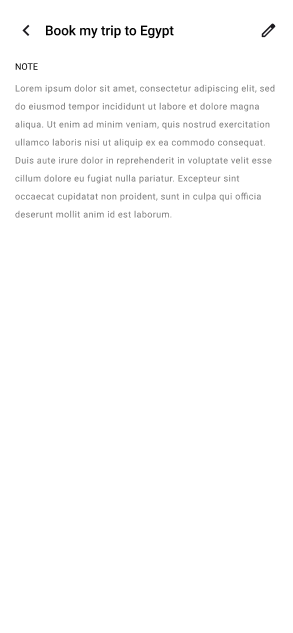
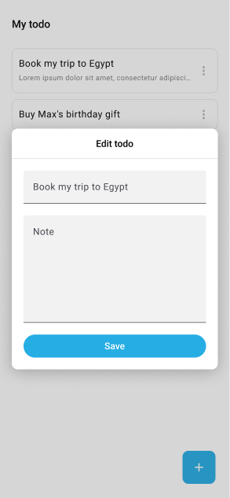
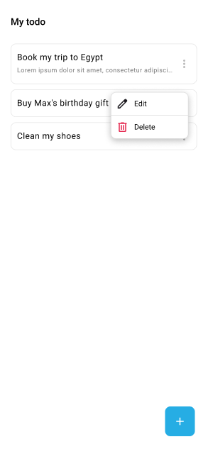

# Flutter challenge guidelines

## Objective

Develop a Flutter mobile application that manages a task list (a TODO list).
The application should allow to create, edit, delete, list, and view the tasks.
It is essential that the application can operate in offline mode, enabling the user to manage tasks even when the device has no network connection.

### Technical Specifications

**1. Required Pages**:

The application must have at least 4 pages (refer to the [mockups](#mockups) below):

- List Page: Displays the list of tasks.
- Creation Page: Form to create a new task.
- Details Page: Displays the details of a specific task.
- Edit Dialog: A dialog to modify an existing task.

**2. Recommended Libraries:**

We use the following libraries internally, but you are completely free to make your own choices:

- Isar: For local data management.
- Go_Router: For navigation management within the application.
- Bloc: For reactive state management.
- Chopper / Json_Serializable: For REST API calls (if needed) and data serialization.

**3. Architecture:**

Implementing an architecture that follows CLEAN principles will be highly appreciated.
However, you are free to choose the specific implementation.
The objective is to demonstrate your ability to structure the code in a modular and maintainable way.

**4. Bonus Features (not mandatory):**

- Task search
- Reordering of tasks
- The ability to take a photo and associate it with a task, as well as to add attachments

### Deliverable

The project should be able to be executed with `flutter run` on an `Android Pixel 7 (API 34)` emulator.

Provide the `dart-defines` in a json format if necessary. The project should run from the command `flutter run --debug --dart-define-from-file=defines.json`

We will evaluate:

- the code quality (soundness and readability)
- the application architecture
- your creativity regarding the exercise

## Mockups

Those mockups are an inspiration for the design of the application. You are free to make changes to the design as you see fit.

### List Page

The list page displays the list of tasks. The displayed tasks are ordered by creation date.

### Creation Page

The creation page is a form to create a new task. The task has a title and note.

### Detail Page

The detail page displays the details of a specific task.

### Edit Dialog

The edit dialog is a dialog to modify an existing task.

### Task options

The task options dialog is a dialog to edit or to delete a task.

